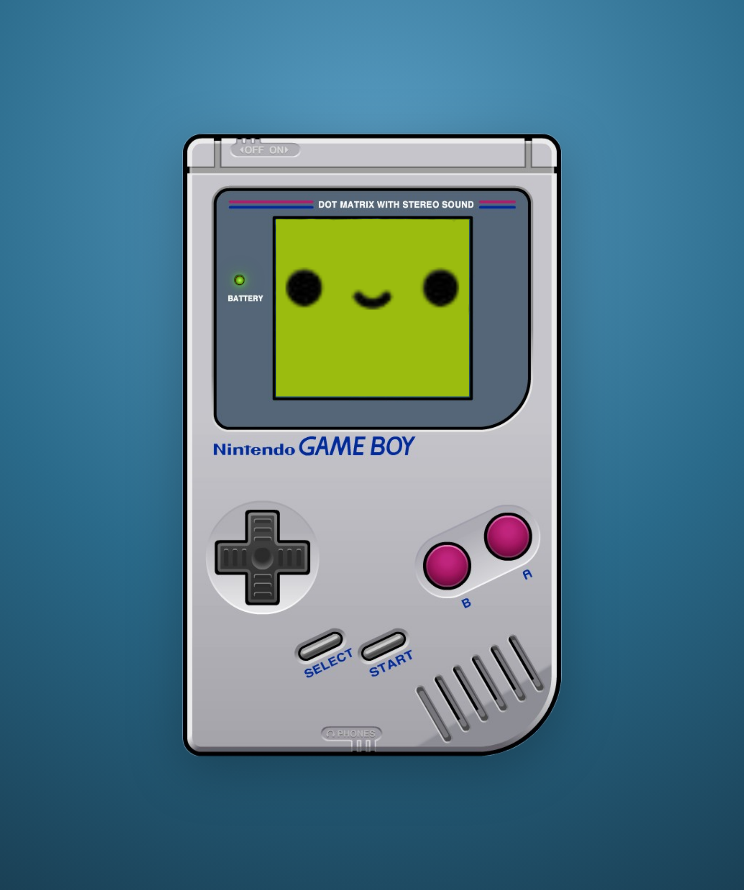
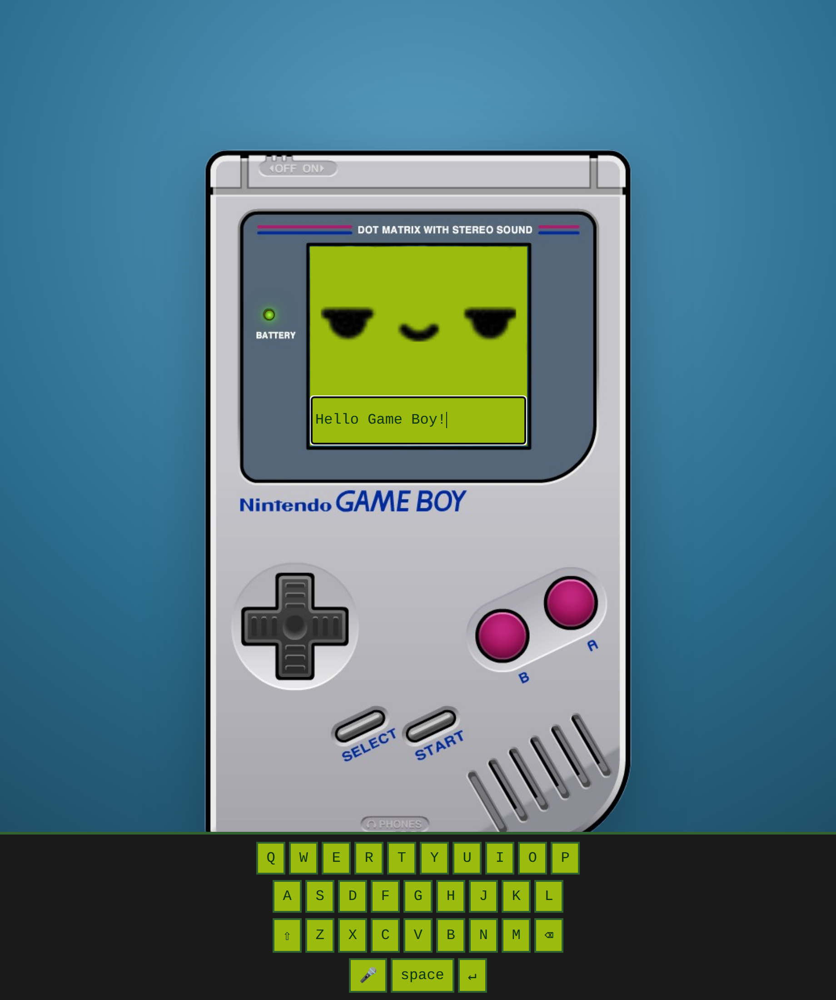
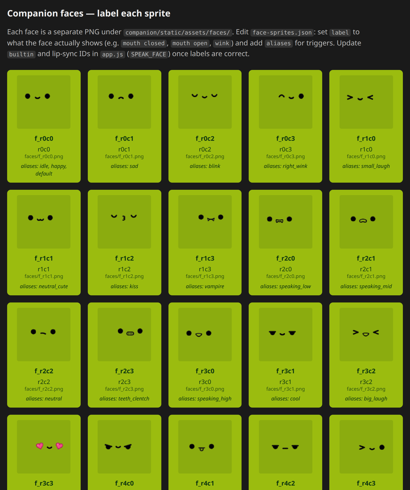

# GameBoy

**A local-first AI companion inside a Game Boy shell.**

Talk to a language model through a nostalgic handheld UI: type or speak a prompt, get a spoken reply, and watch a 32-expression pixel face react on the LCD—with lip-sync, idle animations, and fully remappable controls.

Everything runs on your machine. No cloud account required for the UI; point it at LM Studio, Ollama, or any OpenAI-compatible chat API you already run locally.

**GameBoy is the finished project** — a self-hosted AI companion in a Game Boy–style shell. It is not a ROM emulator and does not run classic Game Boy games.

## Screenshots

<p align="center">
  
</p>
<p align="center"><em>Idle companion on the retroboy shell — health LED, auto face, and calibrated overlays.</em></p>

<p align="center">
  
</p>
<p align="center"><em>Start opens the prompt and virtual keyboard; faces react while you type or speak.</em></p>

<p align="center">
  
</p>
<p align="center"><em>Built-in face gallery (<code>/face-gallery.html</code>) for labeling and previewing all 32 sprites.</em></p>

---

## Features

| Area | What you get |
|------|----------------|
| **Shell UI** | Responsive retroboy shell with calibrated LCD, D-pad, A/B, Start/Select, and power switch |
| **Chat** | Multi-turn conversations via OpenAI-compatible `/v1/chat/completions` |
| **Voice in** | Browser mic → Whisper STT → auto-submit |
| **Voice out** | Piper TTS with symbol stripping, sentence pauses, and cartoon pitch |
| **Faces** | 32 PNG sprites, auto states (idle, blink, think, listen, speak, error), RMS lip-sync |
| **Customization** | JSON-driven faces, button actions, overlay positions—no build step |
| **Health LED** | Green = ready; red = missing model or backend (hover for details) |
| **Offline demo** | Built-in `echo` backend when no LLM server is running |

---

## Quick start

### Prerequisites

- **Python 3.11+** (3.14 tested)
- **~130 MB** free disk (Piper voice models, fetched on first run)
- **Optional:** [LM Studio](https://lmstudio.ai/), [Ollama](https://ollama.com/), or another OpenAI-compatible server

### Install and run

```bash
git clone git@github.com:SketchOTP/GameBoy.git
cd GameBoy
./scripts/run-companion.sh
```

Open **http://127.0.0.1:8765** in your browser.

The run script will:

1. Create a virtualenv and install Python dependencies
2. Download shell and face assets if missing
3. Download Piper ONNX voices if missing
4. Start the FastAPI server with hot reload

### Connect your LLM

```bash
export LMSTUDIO_BASE="http://127.0.0.1:1234/v1"   # LM Studio default
# export LMSTUDIO_BASE="http://127.0.0.1:11434/v1"  # Ollama
./scripts/run-companion.sh
```

Load a chat model in your server, then check the shell’s **battery LED**—it should glow **green** when Piper, Whisper, and at least one backend are available.

### Try it

1. Press **Start** → new chat session, keyboard opens.
2. Type a message, or press **A** to speak.
3. Press **D-pad Down** or **Start** to send.
4. The companion thinks, replies, and speaks with animated lip-sync.

---

## How it works

```
┌─────────────────────────────────────────────────────────┐
│  Browser  (companion/static/)                           │
│  · Retro shell + transparent button hit targets         │
│  · Canvas LCD (faces, lip-sync)                         │
│  · On-screen keyboard + mic capture                     │
└──────────────────────────┬──────────────────────────────┘
                           │ REST
┌──────────────────────────▼──────────────────────────────┐
│  FastAPI  (companion/server.py)                          │
│  · /api/chat      → LM Studio / echo                    │
│  · /api/tts       → Piper ONNX                          │
│  · /api/stt       → faster-whisper                      │
│  · /api/health    → system status                       │
└──────────────────────────┬──────────────────────────────┘
                           │
         ┌─────────────────┼─────────────────┐
         ▼                 ▼                 ▼
   Local LLM API    companion/models/   CPU inference
   (your choice)    Piper .onnx         Whisper tiny+
```

**Chat flow:** prompt → LLM → text reply → TTS → audio playback + speaking faces. Message history lives server-side until you start a new session (**Start** with prompt closed) or call `POST /api/chat/session/reset`.

**Face flow:** `face-sprites.json` defines 32 sprites and which id maps to each app state. The client auto-trims transparent pixels, scales to the LCD, and drives mouth shapes from audio RMS during TTS.

---

## Project structure

Application code lives in `companion/`:

```
GameBoy/
├── companion/
│   ├── server.py              # FastAPI: chat, TTS, STT, static files
│   ├── chat_session.py          # Multi-turn LLM history
│   ├── tts_sanitize.py          # Strip markdown/symbols before speech
│   ├── tts_prepare.py           # Sentence splits, pauses, emphasis
│   ├── requirements.txt
│   ├── models/                # Piper voices (downloaded, not in git)
│   ├── static/
│   │   ├── index.html           # Main UI
│   │   ├── app.js               # Faces, buttons, chat, overlays
│   │   ├── face-gallery.html    # Preview & label sprites
│   │   └── assets/
│   │       ├── face-sprites.json
│   │       ├── faces/*.png
│   │       ├── overlay-viewport.json
│   │       └── retroboy-shell.png
│   └── test_*.py
├── scripts/
│   ├── run-companion.sh
│   ├── fetch-companion-assets.sh
│   ├── fetch-companion-models.sh
│   └── split-face-sprites.py
├── docs/
│   ├── companion-buttons.md
│   └── companion-faces.md
└── README.md
```

---

## Configuration

### Environment variables

Set before starting the server (export in your shell or wrap `run-companion.sh`).

| Variable | Default | Description |
|----------|---------|-------------|
| `LMSTUDIO_BASE` | `http://127.0.0.1:1234/v1`* | OpenAI-compatible API base URL |
| `LMSTUDIO_MODEL` | auto-detect | Force a specific model id |
| `PIPER_MODEL` | `en_US-lessac-low.onnx` | Path to Piper voice file |
| `PIPER_LENGTH_SCALE` | `0.68` | Speech rate (`< 1` = faster) |
| `PIPER_NOISE_SCALE` | `0.78` | Piper generator noise |
| `PIPER_NOISE_W_SCALE` | `0.88` | Piper duration noise |
| `PIPER_EMPHASIS_SCALE` | `0.85` | Extra slowdown on `!` and `?` |
| `WHISPER_MODEL` | `tiny` | Whisper model size |
| `WHISPER_CPU_THREADS` | `min(4, cpus)` | STT thread count |

\*If unset in your environment, check `companion/server.py` for the compiled default and override with `export LMSTUDIO_BASE=...`.

### LLM backends

| Backend | ID | Notes |
|---------|-----|-------|
| LM Studio / Ollama / compatible | `lmstudio` | Uses `LMSTUDIO_BASE` + `/chat/completions` |
| Offline echo | `echo` | Returns `*beep* {your text}` — always available |

Press **Select** to cycle backends silently.

**Use Ollama without code changes:**

```bash
export LMSTUDIO_BASE="http://127.0.0.1:11434/v1"
./scripts/run-companion.sh
```

**Add a custom backend:** extend `ChatRequest.backend`, implement a handler in `companion/server.py`, register it in `backends()` and `chat()`, restart.

No system prompt is injected by the companion—the preset in your LLM server is used as-is.

---

## Customization guide

### Faces

**Registry:** `companion/static/assets/face-sprites.json`

| Task | How |
|------|-----|
| Change idle / thinking / speaking faces | Edit the `"builtin"` object |
| Add readable names | Add `"aliases": ["cool"]` on a face entry |
| Random idle expressions | Edit `"idleThoughts"` array |
| Replace art | Swap PNGs in `assets/faces/` or re-split with `scripts/split-face-sprites.py` |
| Preview all sprites | Open `/face-gallery.html` |

Example builtin mapping:

```json
"builtin": {
  "idle": "f_r0c0",
  "blink": "f_r0c2",
  "typing": "f_r3c1",
  "listening": "f_r2c2",
  "speaking_low": "f_r2c0",
  "speaking_high": "f_r2c1",
  "speaking_inflection": "f_r3c0",
  "thinking": "f_r4c2",
  "error": "f_r6c1"
}
```

Reload the page after editing—no build step.

### Buttons

Default actions live in `defaultButtonAction()` inside `companion/static/app.js`.

| Button | Prompt closed | Prompt open |
|--------|---------------|-------------|
| **Start** | New session + keyboard | Submit |
| **A** | Mic on / off + send | Same |
| **B** | Cancel all | Same |
| **Select** | Cycle LLM backend | Same |
| **D-pad Up** | Open keyboard | — |
| **D-pad Down** | — | Submit |
| **D-pad Left** | Previous background | Backspace |
| **D-pad Right** | Next background | Space |
| **Power ON** | Overlay calibrate mode | Same |
| **Power OFF** | Exit calibrate + save | Same |
| **Phones / Speaker** | Reserved (events only) | Same |

**Override without forking** (browser console or injected script):

```javascript
CompanionButtons.on("speaker", () => {
  CompanionFace.show("big_laugh", { durationMs: 1500 });
});

window.addEventListener("companion:button", (e) => {
  console.log("Button:", e.detail.id);
});
```

See [`docs/companion-buttons.md`](docs/companion-buttons.md) for the full reference.

### Overlay placement (buttons, LCD, battery LED)

Positions use **shell pixel coordinates** (864×1080 on `retroboy-shell.png`).

**In the UI (recommended):**

1. Press **Power ON** → red calibration overlays appear.
2. **Drag** to move; drag the **corner handle** to resize.
3. Applies to all 12 buttons **and** the battery LED.
4. Press **Power OFF** to save and exit.

**In JSON:**

- Defaults: `companion/static/assets/overlay-viewport.json`
- Saved tweaks: `companion/static/assets/overlay-overrides.json`

```json
{
  "buttons": {
    "a": { "x": 600, "y": 638, "w": 43, "h": 43 },
    "battery_led": { "x": 242, "y": 305, "w": 12, "h": 12 }
  }
}
```

Minimum size: **20 px** (buttons), **6 px** (battery LED).

### Battery LED

| Color | Meaning |
|-------|---------|
| Green | Piper + Whisper + chat backend OK |
| Red | Check tooltip on hover |
| Hidden | Before first health poll |

Calibrate size/position in overlay mode like any other element.

---

## JavaScript APIs

Embed or extend the UI from DevTools, a bookmarklet, or a parent page.

### `CompanionFace`

```javascript
CompanionFace.show("thinking", { durationMs: 2000 });
CompanionFace.release();
CompanionFace.resolve("blink");   // → "f_r0c2"
CompanionFace.list();
CompanionFace.builtin();
```

### `CompanionButtons`

```javascript
CompanionButtons.list();
CompanionButtons.on("a", () => { /* custom */ });
CompanionButtons.off("a");
CompanionButtons.showHitDebug();   // calibrate overlays
CompanionButtons.resetOverlayOverrides();
```

Events: `companion:face`, `companion:button`, `companion:button-request`, `companion:face-request`.

Details: [`docs/companion-faces.md`](docs/companion-faces.md).

---

## HTTP API

| Method | Path | Body / response |
|--------|------|-----------------|
| `GET` | `/api/health` | Piper, Whisper, backend status |
| `GET` | `/api/backends` | `[{ id, label, available }]` |
| `POST` | `/api/chat` | `{ "prompt", "backend" }` → `{ text, backend }` |
| `POST` | `/api/chat/session/reset` | Clear message history |
| `POST` | `/api/tts` | `{ "text" }` → `audio/wav` |
| `POST` | `/api/stt` | `multipart` audio → `{ text }` |
| `GET/PUT` | `/api/overlay-overrides` | Saved button/LED geometry |

Static UI and assets are served from `/` and `/assets/…`.

---

## Easter eggs

- **D-pad Left / Right** (prompt closed): cycle 49 background colors (saved after 10 s idle).
- **Secret combo** (5 s window): Start → A → A → B → B → Up → Down → 10 s party mode.

Customize in `app.js`: `BG_COLORS`, `SECRET_COMBO`, `PARTY_NEON_COLORS`.

---

## Tests

```bash
python3 -m pytest companion/ -q
```

Covers lip-sync markers, TTS sanitization/preparation, and chat session helpers.

---

## Credits

- Shell art: `retroboy-shell.png` (@edbooth_art) — see `companion/static/assets/CREDITS.txt`
- Face sprites: 4×8 expression sheet, split into individual PNGs
- **Nintendo Game Boy** is a trademark of Nintendo Co., Ltd. This project is not affiliated with or endorsed by Nintendo.

---

## License

No project-wide license file is included yet. Third-party assets may carry their own terms—check `CREDITS.txt` before redistributing artwork.
